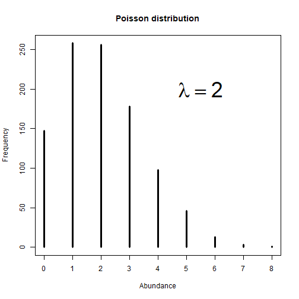

layout: true

background-image: url('niche-comparison.png'), url('blbw.png')
background-size: 60%, 20%
background-position: left bottom, top left
---
class: center, right

# Fundamentals of Ecological Modeling  

### E.g., Where are we going in this class? 

## Andy Crosby  
### January 15, 2024  
<br />

## <a href="https://colab.research.google.com/drive/1n_sbJbTRXA8sT1gDfcKKCPE9IPWhA05x#scrollTo=51f4ec3e-034c-4ea2-bb2d-7b3986778353">Google CoLab Lecture Link</a>
---
layout: false 

# What is Ecology? 

## Very often, it is the study of of the distribution and abundance of plants and animals  

## ***Spatio-temporal variability*** 
.pull-left[
### Space 
* ### How many are there? 
* ### How are they distributed? 
]
.pull-right[
### Time 
* ### Are there more this year than last?
* ### Are they here in winter but not summer?
]
--
.center[
## ***Why*** do we see this particular pattern? 
]


???
Ecology is the study of the relationships among living organisms and the physical environment. These interactions can include:

Habitat selection
Predator-prey dynamics
Trophic cascades
Disturbance and succession dynamics...
Ecologists study Ecology (duh!)

One of the dominant branches of ecology is: the study of spatio-temporal variability in the distrubution and abundance of species (Krebs 2003].

Many research questions involve asking:

How many are there?
Where are they?
Why do we see this particular pattern? 

Don't forget about the importance of time, e.g.:
* There are more this year then last year 

* They are here in the fall but not the winter 

---

# Modeling as a Way of Doing Science  

## Science is a process for learning about nature in which competing ideas about how the world works are measured against observations (Feynman 1965, 1985)  

## Classical statistics are built on certain assumptions:  

* Experimental conditions with replication and randomization
* Few variables, with controls 
* Statistical hypothesis testing 

## Often referred to as 'design-based inference' See: [Gregoire (1998)](https://cdnsciencepub.com/doi/10.1139/x98-166)

???

We often (not always) use statistics in the conduct of science for 2 reasons:
1.  We can rarely ever make observations on the entire population of interest
2.  We can't always observe the thing we are interested in

Within a properly designed sampling framework, statistics allows us to make *inferences* about how the world works

Classical statistics are built on certain assumptions:
* Assume experimental conditions with replication
* One or a few variables, with everything else controlled for
* Tends to rely on statistical hypothesis testing (i.e., the all-knowing *P-value*)

In most real-world ecological questions, doing classical experiments that contrast data with a single null hypothesis is impossible.

---
# A very simple statistical model: 

## Model-based inference is based on distributional assumptions about the underlying data-generating process ([Williams and Brown 2019](https://doi.org/10.1111/2041-210X.13279)) 

## For example:

## $$y \sim Poisson(\lambda)$$ 

## is a model. 

???
We are saying that the count of something (e.g., birds at a point count station) is Poisson distributed with expected value $lambda$; i.e., we are making a distributional asusmption about the data-generating process.

---
# We can visualize this with a simple simulation
.pull-left[
```{r poisson-random, fig.show = 'hide', eval = FALSE}
plot(table(rpois(1000, 2)), 
     lwd = 3, 
     ylab = "Frequency", 
     xlab = "Abundance", 
     main = "Poisson distribution")
text(5.5, 200, 
     expression(lambda == 2), cex = 3)
```
]

.pull-right[

]

???
Let's say we expect that $\lambda=2$. What this means in practice is that, if we go to a number of point count stations in exactly the same habitat, we would most often find 2 birds there; less often we would find 1 or 3 or 0; and very rarely we might find 6 or 7.

If we wanted to evaluate this model against observations, we would do point counts at $x$ number of sample units where the expected count is 2, and measure how well the observations fit the model.


---
# Why use models (instead of experiments): [Hilboun and Mangel Ch. 1](https://press.princeton.edu/books/paperback/9780691034973/the-ecological-detective)

- ## Long time scales 

- ## Poor replication  

- ## Inability to control 

## Use observations, rather than experiments, to assess support for hypotheses  
## Challenge is in generating system dynamics 


???

Long time scales: Many ecological systems have time scales of years or decades

Many ecological systems are difficult to replicate, and replicates are rarely, if ever, perfect 

One can rarely, if ever, control all aspects of an ecological experiment 

***Modelling allows us to make inference about populations outside the constraints of classical experimental design requirements.***

**But...** SAMPLING DESIGN IS STILL IMPORTANT

* Biased sampling will still bias results if not accounted for in the model
* It is better to prevent bias with a good sampling design than try to address it in the models
* Re-purposing exisitng data presents its own special challenges (e.g., tha BAM database)

---
class: center middle 

# **Some Fundamental Principles**

---
# System Dynamics and Inference ([MacKenzie et al. 2018](https://www.sciencedirect.com/book/9780124071971/occupancy-estimation-and-modeling#book-description))


???
Inference: a conclusion reached from evidence and reasoning (Oxford)
System Dynamics: Changing something within the system and measuring the response to that change.  
* The thing you change is the predictor variable  
* Measure the change in both the predictor and the response 
* Draw conclusions (i.e. make inferences) about the relationship between the predictor and the response

The strength of the inference you are able to make depends on how you generate the system dynamics 

## **Manipulative experiments:**  
* replication  - allows estimation of error 
* randomization - protects against bias
* application of treatments - reflect hypotheses about causal factors  
One treatment is typically a control (no treatment) 

## Example of randomized medical trial 

## **Constrained design (quasi-experiments)**  
* Lack replication or randomization or both  
* True in a lot of field studies  

## Example of my masters research 

## **Obeservational Studies:**  
* Can't manipulate anything 
* System dynamics from spatial and/or temporal variation in predictor variable(s)  
  - *a priori* hypotheses - predictions of what the pattern should be if a hypothesis is true  
  - *a posteriori* hypotheses - explanations after the results are seen  
The problem with *a posteriori* hypotheses is that there can often be a number of alternative explanations for why a particular pattern is seen. 

## Example of typical macroecology study 

---
# **Remember:** 
<br />
<br />
<br />

.center[
# **There are always ecological assumptions *implicit within* your model**
]

---
# Some Key definitions 
## **Population:** the complete set of sampling units 
## **Sample:** subset of the population observed  
## **Parameter:** Characteristic of the population  
## **Parameter estimator:** e.g. $\mu$ vs. $\hat{\mu}$  
## **Parameter estimate:** e.g. $\hat{\mu}=12$
## **State variable:** variable to quantify current status (e.g. population size)

???
What is the population of interests? 
* sometimes not the species, but the area that is sampled. 

Estimator - an equation or process applied to the data to produce an estimate of the parameter 

State variable - variable used to quantify the current status of a population or community  
* e.g., abundance, species richness, population trend 


---
# General principles of sampling animal populations
*sensu* [Yoccoz et al. 2001](https://www.sciencedirect.com/science/article/pii/S0169534701022054?via%3Dihub)

## **Why?**
## First, you need a well-defined objective! 

* ## Science 
  - ### Discriminating among competing hypotheses

* ## Management and Conservation 
  - ### Estimating sytem state 

---
# Science  
## Confronting model-based predictions with data: e.g., 

* ## Is recruitment density dependent?

### $$r=N_fb$$  
## or
### $$r=N_fb(N_f)$$  

## Which model fits the data better? 

???
where $r$ is the number of recruits to a population, $N_f$ is the number of females in the population, and $b$ is the average number of recruits per female. Thus, $b(N_f)$ says that $b$ is a function of the number of females in the population.

---
# Management and Conservation  
## Estimating state variables - 3 distinct purposes ([Yoccoz et al. 2001](https://www.sciencedirect.com/science/article/pii/S0169534701022054?via%3Dihub)) 

## 1. Making state-dependent management decisions 
 - ### Change harvest regulations? 
 
## 2. Inclusion in 'objective functions' 
  - ### Are management objectives being met? 
  
## 3. Predicting system response to management 

## All require reliable estimates of system state

---
# **What?**
## Which state variables to measure? 

* ### Abundance? 
* ### Occupancy rate? 
* ### Survival rate? 
* ### Vocalization rate? 
* ### Species richness?

---
# **How?**  
## This is your smampling design 

## Amost always involves ***SAMPLING***.  
## Sampling *always* involves ***UNCERTAINTY***

## *Sampling must be done in a way that allows us to make **INFERENCE** about about the part of the entire population* 

---
# **3 Keys to Remember:**  
## 1. We are usually basing inference on a small sample from the population of interest.  
## 2. We are obtaining *uncertain* estimates of the parameters (quantities) we are interested in.
## 3. *Statistical inference is a rigorous method for drawing conlculsions about the quantities of interest (e.g., the numerical response of a species to a habitat attribute) in the face of uncertainty.*  

*For a more detailed treatment, read Part I of:  
MaKenzie, D.I., Nichols, J.D., Royle, J.A., Pollack, K.H., Bailey, L.L., and Hines, J.E. 2018. Occupancy estimation and modelling: inferring patterns and dynamics of species occurrence. Second Edition. Elsevier. Cambridge, Massachusetts, USA.

---
class: center middle 

# **Two Major Advances**

---
# 1. Detectability in Unmarked Populations 
## Why estimate detection probability? 
## We know how many we saw; we need to estimate how many we missed!

## $$E(C_{i})=N_{i}p$$

## $$N_{i}=\frac{C_{i}}{p}$$

### Where $E(C_{i})$ is expected count at site $i$; $N_i$ is number of individuals at site $i$; and $p$ is detection probability 

???
Occupancy is a special case of this, where $N_i$ is the number of sites, rather than the number of individuals 

---
# Detectability illustrated ([MacKenzie et al. 2018](https://www.sciencedirect.com/book/9780124071971/occupancy-estimation-and-modeling#book-description))


---
name: binomial-detection
# We can model the detection process using a binomial distribution

## $$C_i\sim Binomial(N, p),$$
##  Where $N$ is the number of individuals (or visits), and $p$ is the detection probability of each individual 

## There are many ways to estimate $p$ 
* ### Mark-recapture (and 'unmarked' recapture) sampling
* ### Distance sampling 

---
# Thinking Hierarchically

## Modeling the eoclogical and observation processrd sumultaneously 

## The ecological model for abundance at site $i$: $$N_i\sim Poisson(\lambda)$$ 
## The observation model given $N$ individuals at site $i$: $$y_i \sim Binomial(N_i, p)$$ where $y_i$ is the number if individuals detected ([see previous slide!](#binomial-detection))

???
2 key things to notice: 
1. $N_i$ is the connection between the 2 models, so that the count is conditional on the number of individuals 
2. The true number of individuals $N_i$ is a 'latent' variable, meaning it is not observed directly

---
# 2. Accessibility of Bayesian Methods   
## In the 'old days', Bayesian anlysis was only accessible to statisticians with specialized computing skills 

## Two things changed this: 
### a. The development of WinBUGS software and the BUGS language ([Lunn et al. 2000](https://link.springer.com/article/10.1023/A:1008929526011)) 

* BUGS = **B**ayesian inference **U**sing **G**ibbs **S**ampling 

### b. The publishing of [Introtduction to WinBUGS for Ecologists](https://www.sciencedirect.com/book/9780123786050/introduction-to-winbugs-for-ecologists) by Mark Kéry 

???
* The BUGS language allows users with minimal coding experience to write Bayesian models as simple 'for' loops  

* Mark Kéry developed an elegant, not-technical tutorial style, using data simulations, that has been much copied since  

We are going to delve more deeply into Bayesian anlysis in a few weeks, but the key take-home here is that you will be able to see that it is no more difficult (and often much more intuitive and understnadbale) than frequentist analysis  

---
# A list of resources for Bayesian modeling in ecology 
## [Introtduction to WinBUGS for Ecologists](https://www.sciencedirect.com/book/9780123786050/introduction-to-winbugs-for-ecologists) (Kéry 2010): UAlberta Library or [free download](https://www.sciencedirect.com/book/9780123786050/introduction-to-winbugs-for-ecologists)
* ### [Online companion](https://www.vogelwarte.ch/modx/de/projekte/publikationen/bpa/kery-2010-book) 

## [Bayesian Populaiton Analysis Using WinBUGS: a Hierarchical Perspective](https://www.vogelwarte.ch/modx/de/projekte/publikationen/bpa/#:~:text=Bayesian%20population%20analysis%20using%20WinBUGS%20is%20a%20gentle%20introduction%20to,code%20should%20work%20as%20well) (Kéry and Schaub 2011) UAlberta Library

## [Statistical Rethinking](https://www.taylorfrancis.com/books/mono/10.1201/9780429029608/statistical-rethinking-richard-mcelreath) (McElreath 2020): UAlberta Library 
* ### [Free course through Github](https://github.com/rmcelreath/stat_rethinking_2024) 

---
# Additional Resources 
## [Applied Hierarchical Modeling in Ecology Volume 1](https://www.sciencedirect.com/book/9780128013786/applied-hierarchical-modeling-in-ecology) (Kéry and Royle 2015) Free download

## [Applied Hierarchical Modeling in Ecology Volume 2](https://www.sciencedirect.com/book/9780128237687/applied-hierarchical-modeling-in-ecology-analysis-of-distribution-abundance-and-species-richness-in-r-and-bugs) (Kéry and Royle 2020) Free download 

## [Hierarhcical Modeling and Inference in Ecology](https://www.sciencedirect.com/book/9780123740977/hierarchical-modeling-and-inference-in-ecology#book-description) (Royle and Dorazio 2008) Free download


